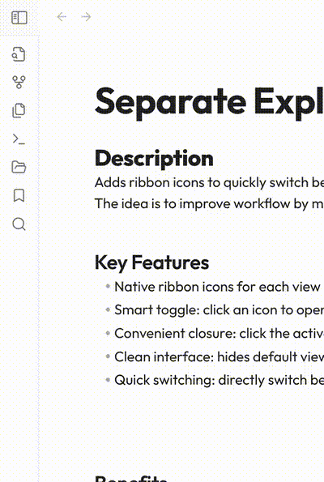

# Separate Explorer Views for Obsidian

"Separate Explorer Views" enhances Obsidian's user experience by adding three dedicated ribbon icons to manage the display of file explorer, search, and bookmarks views.
The idea is to improve workflow by making access to different views more intuitive and faster while reducing clutter.

## Description

### Key Features

- Native ribbon icons for each view
- Convenient closure: click the active view's icon to close the panel
- Clean interface: hides default view selector tabs in the panel

### Benefits

- Faster navigation between views
- Reduced number of necessary clicks
- Cleaner user interface
- Compatible with all themes
- No configuration required

### Demo

## Installation

### Manual Installation

1. Download the latest release
2. Extract the zip archive in your vault's `.obsidian/plugins` directory
3. Reload Obsidian
4. Enable the plugin in Settings > Community Plugins

## Usage

After enabling the plugin, you'll see three new icons in your ribbon (the vertical toolbar on the left):
- Folder icon: Toggle File Explorer
- Search icon: Toggle Search
- Bookmark icon: Toggle Bookmarks

To switch between views, simply click the corresponding icon. Click the active view's icon to close the explorer panel.

## License

This project is licensed under the MIT License - see the LICENSE file for details.
